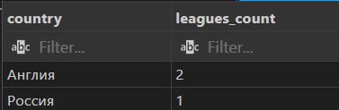

```sql
-- COUNT #1: количество стадионов
SELECT COUNT(*) AS stadiums_count
FROM football_club.stadiums;
```


```sql
-- COUNT #2: количество лиг по странам
SELECT country, COUNT(*) AS leagues_count
FROM football_club.league
GROUP BY country
ORDER BY leagues_count DESC, country;
```



```sql
-- SUM #1: суммарная вместимость всех стадионов
SELECT SUM(capacity) AS total_capacity
FROM football_club.stadiums;
```


```sql
-- SUM #2: сумма уровней лиг по странам 
SELECT country, SUM(tier) AS sum_tier
FROM football_club.league
GROUP BY country
ORDER BY sum_tier DESC, country;
```


```sql
-- AVG #1: средняя вместимость стадионов
SELECT AVG(capacity) AS avg_capacity
FROM football_club.stadiums;
```


```sql
-- AVG #2: средний уровень лиг по странам
SELECT country, AVG(tier) AS avg_tier
FROM football_club.league
GROUP BY country;
```


```sql
-- MIN #1: минимальная вместимость стадиона
SELECT MIN(capacity) AS min_capacity
FROM football_club.stadiums;
```


```sql
-- MIN #2: минимальный уровень лиги по странам
SELECT country, MIN(tier) AS min_tier
FROM football_club.league
GROUP BY country;
```


```sql
-- MAX #1: максимальная вместимость стадиона
SELECT MAX(capacity) AS max_capacity
FROM football_club.stadiums;
```


```sql
-- MAX #2: максимальный уровень лиги по странам
SELECT country, MAX(tier) AS max_tier
FROM football_club.league
GROUP BY country;
```


```sql
-- STRING_AGG #1: список лиг по стране
SELECT country, STRING_AGG(name, ', ' ORDER BY name) AS leagues
FROM football_club.league
GROUP BY country
ORDER BY country;
```


```sql
-- STRING_AGG #2: список турниров по региону
SELECT region, STRING_AGG(name, ' | ' ORDER BY name) AS tournaments
FROM football_club.tournament
GROUP BY region;
```


```sql
-- GROUP BY #1: число лиг по странам
SELECT country, COUNT(*) AS leagues
FROM football_club.league
GROUP BY country;
```


```sql
-- GROUP BY + HAVING #2: страны с не менее чем 1 лигой уровня 1 или выше
SELECT country, COUNT(*) AS leagues
FROM football_club.league
WHERE tier >= 1
GROUP BY country
HAVING COUNT(*) >= 1;
```


**GROUPING SETS, ROLLUP и CUBE**
```sql
-- GROUPING SETS #1: 
SELECT country, tier, COUNT(*) AS leagues
FROM football_club.league
GROUP BY GROUPING SETS ((country, tier), (country), (tier), ());
```


```sql
-- GROUPING SETS #2: 
SELECT region, format, COUNT(*) AS tournaments
FROM football_club.tournament
GROUP BY GROUPING SETS ((region, format), (region), (format), ());
```


```sql
-- ROLLUP #1: 
SELECT country, tier, COUNT(*) AS leagues
FROM football_club.league
GROUP BY ROLLUP (country, tier);
```


```sql
-- ROLLUP #2: 
SELECT region, format, COUNT(*) AS tournaments
FROM football_club.tournament
GROUP BY ROLLUP (region, format);
```


```sql
-- CUBE #1: все комбинации измерений для лиг
SELECT country, tier, COUNT(*) AS leagues
FROM football_club.league
GROUP BY CUBE (country, tier);
```


```sql
-- CUBE #2:
SELECT region, format, COUNT(*) AS tournaments
FROM football_club.tournament
GROUP BY CUBE (region, format);
```


```sql
--  #1
SELECT country,
       COUNT(*) AS leagues,
       AVG(tier) AS avg_tier
FROM football_club.league
WHERE tier >= 1
GROUP BY country
HAVING AVG(tier) >= 1;
```


```sql
-- #2
SELECT region,
       COUNT(*) AS tournaments,
       STRING_AGG(DISTINCT format, ', ' ORDER BY format) AS formats
FROM football_club.tournament
WHERE format IS NOT NULL
GROUP BY region
HAVING COUNT(*) >= 1;
```


