
```sql
-- CTE 1: клубы с зарплатой выше среднего
WITH club_avg AS (
    SELECT fc.name AS club_name, AVG(CAST(c.salary AS NUMERIC)) AS avg_salary
    FROM football_club.football_clubs fc
    JOIN football_club.players p ON p.club_id = fc.club_id
    JOIN football_club.contracts c ON c.player_id = p.player_id
    GROUP BY fc.name
),
league_avg AS (
    SELECT AVG(CAST(salary AS NUMERIC)) AS avg_salary
    FROM football_club.contracts
)
SELECT club_name, club_avg.avg_salary
FROM club_avg, league_avg
WHERE club_avg.avg_salary > league_avg.avg_salary
ORDER BY club_avg.avg_salary DESC;
```

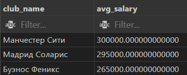


```sql
-- CTE 2: клубы с минимум двумя игроками
WITH player_counts AS (
    SELECT fc.name AS club_name, COUNT(*) AS cnt
    FROM football_club.football_clubs fc
    JOIN football_club.players p ON p.club_id = fc.club_id
    GROUP BY fc.name
)
SELECT club_name, cnt
FROM player_counts
WHERE cnt >= 2
ORDER BY club_name;
```
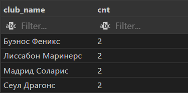

```sql
-- CTE 3: дорогие товары по клубам
WITH shop_products AS (
    SELECT fc.name AS club_name, pr.name AS product_name, CAST(pr.price AS NUMERIC) AS price_value
    FROM football_club.products pr
    JOIN football_club.fun_shop fs ON fs.shop_id = pr.shop_id
    JOIN football_club.football_clubs fc ON fc.club_id = fs.club_id
)
SELECT club_name, product_name
FROM shop_products
WHERE price_value > 8000
ORDER BY club_name;
```
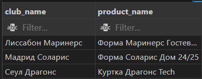

```sql
-- CTE 4: сумма спонсоров по клубам
WITH sponsor_totals AS (
    SELECT fc.name AS club_name, SUM(CAST(sp.amount AS NUMERIC)) AS total_amount
    FROM football_club.sponsors sp
    JOIN football_club.football_clubs fc ON fc.club_id = sp.club_id
    GROUP BY fc.name
)
SELECT club_name, total_amount
FROM sponsor_totals
ORDER BY total_amount DESC;
```
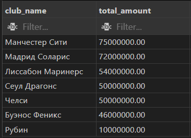

```sql
-- CTE 5: призовые позиции по сезонам
WITH seasons AS (
    SELECT fc.name AS club_name, p.season, p.final_position
    FROM football_club.participation p
    JOIN football_club.football_clubs fc ON fc.club_id = p.club_id
)
SELECT club_name, season, final_position
FROM seasons
WHERE final_position <= 2
ORDER BY club_name, season;
```
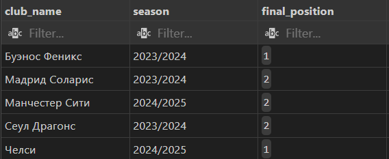

```sql
-- UNION 1: 
SELECT 
    first_name as name,
    salary,
    'Staff' as type
FROM football_club.staff
UNION
SELECT 
    first_name as name,
    salary,
    'Player' as type
FROM football_club.players p
JOIN football_club.contracts c ON p.player_id = c.player_id
ORDER BY salary DESC;
```
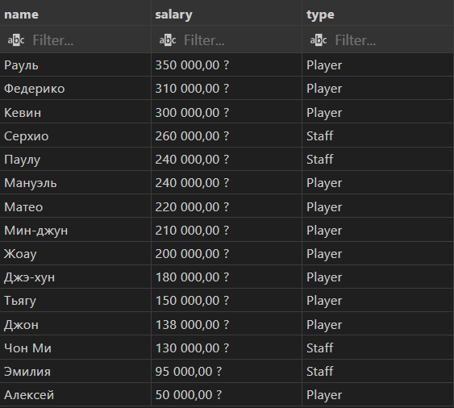

```sql
-- UNION 2: регулярные соревнования
SELECT name AS competition_name
FROM football_club.tournament
UNION
SELECT name
FROM football_club.league
ORDER BY competition_name;
```
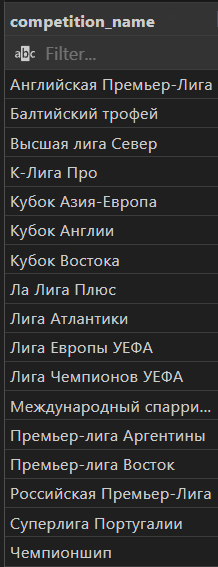

```sql
-- UNION 3: 
SELECT 
    name,
    address,
    'Stadium' as type
FROM football_club.stadiums
UNION
SELECT 
    'Fan Shop ' || shop_id::text as name,
    address,
    'Shop' as type
FROM football_club.fun_shop
ORDER BY type, name;
```
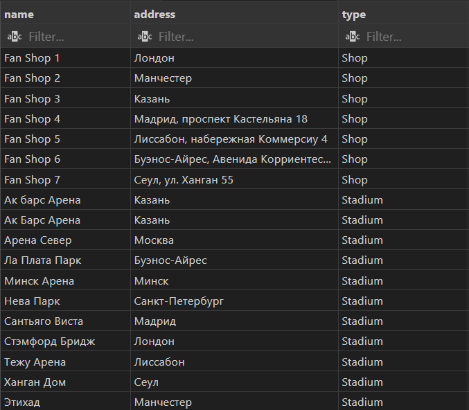

```sql
-- INTERSECT 1: клубы со спонсором и магазином
SELECT fc.name AS club_name
FROM football_club.football_clubs fc
WHERE EXISTS (
    SELECT 1 FROM football_club.sponsors sp WHERE sp.club_id = fc.club_id
)
INTERSECT
SELECT fc.name AS club_name
FROM football_club.football_clubs fc
WHERE EXISTS (
    SELECT 1 FROM football_club.fun_shop fs WHERE fs.club_id = fc.club_id
)
ORDER BY club_name;
```
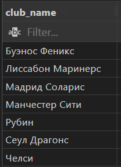

```sql
-- INTERSECT 2: 
SELECT club_id FROM football_club.players
INTERSECT
SELECT club_id FROM football_club.staff;
```


```sql
-- INTERSECT 3: 
SELECT club_id FROM football_club.sponsors
INTERSECT
SELECT club_id FROM football_club.fun_shop;
```
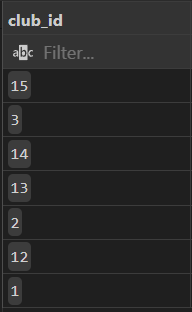

```sql

-- EXCEPT 1: спонсируемые клубы без первого места
SELECT fc.name AS club_name
FROM football_club.football_clubs fc
WHERE EXISTS (
    SELECT 1 FROM football_club.sponsors sp WHERE sp.club_id = fc.club_id
)
EXCEPT
SELECT DISTINCT fc.name
FROM football_club.participation p
JOIN football_club.football_clubs fc ON fc.club_id = p.club_id
WHERE p.final_position = 1
ORDER BY club_name;
```
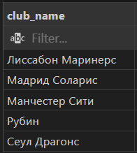

```sql
-- EXCEPT 2: игроки с высокой зарплатой, но не защитники
SELECT p.first_name
FROM football_club.players p
JOIN football_club.contracts c ON c.player_id = p.player_id
WHERE CAST(c.salary AS NUMERIC) >= 170000
EXCEPT
SELECT p.first_name
FROM football_club.players p
WHERE p.position = 'Защитник'
ORDER BY first_name;
```
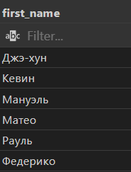

```sql
-- EXCEPT 3: турниры УЕФА без участия клубов
SELECT name
FROM football_club.tournament
WHERE region = 'УЕФА'
EXCEPT
SELECT DISTINCT t.name
FROM football_club.participation p
JOIN football_club.tournament t ON t.tournament_id = p.tournament_id
WHERE t.region = 'УЕФА'
ORDER BY name;
```
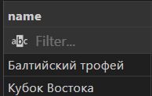
```sql

-- PARTITION 1: средняя рыночная стоимость по позиции
SELECT p.first_name,
       p.position,
       CAST(p.market_value AS NUMERIC) AS market_value,
       AVG(CAST(p.market_value AS NUMERIC)) OVER (PARTITION BY p.position) AS avg_by_position
FROM football_club.players p
ORDER BY p.position, market_value DESC;
```
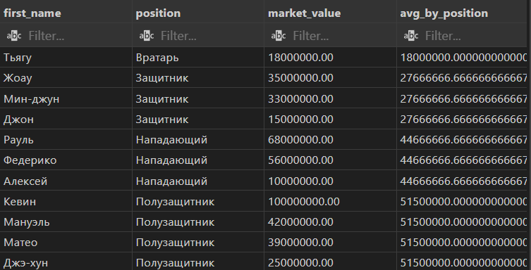
```sql
-- PARTITION 2: сумма спонсорских платежей по клубу
SELECT fc.name AS club_name,
       CAST(sp.amount AS NUMERIC) AS amount_value,
       SUM(CAST(sp.amount AS NUMERIC)) OVER (PARTITION BY fc.name) AS total_per_club
FROM football_club.sponsors sp
JOIN football_club.football_clubs fc ON fc.club_id = sp.club_id
ORDER BY club_name;
```
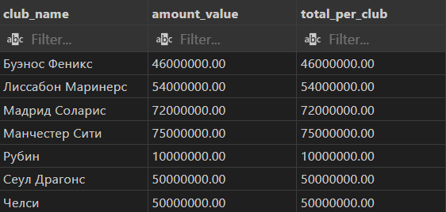
```sql
-- PARTITION+ORDER 1: накопление очков по сезонам (20 - место)
SELECT fc.name AS club_name,
       p.season,
       p.final_position,
       SUM(20 - p.final_position) OVER (
           PARTITION BY fc.name
           ORDER BY split_part(p.season, '/', 1)::INT
       ) AS cumulative_points
FROM football_club.participation p
JOIN football_club.football_clubs fc ON fc.club_id = p.club_id
ORDER BY club_name, season;
```
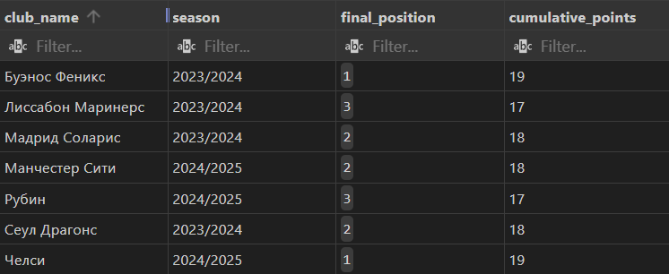
```sql
-- PARTITION+ORDER 2: накопление зарплаты по датам контрактов
SELECT fc.name AS club_name,
       c.start_date,
       CAST(c.salary AS NUMERIC) AS salary_value,
       SUM(CAST(c.salary AS NUMERIC)) OVER (
           PARTITION BY fc.name
           ORDER BY c.start_date
       ) AS running_salary
FROM football_club.contracts c
JOIN football_club.players p ON p.player_id = c.player_id
JOIN football_club.football_clubs fc ON fc.club_id = p.club_id
ORDER BY club_name, c.start_date;
```
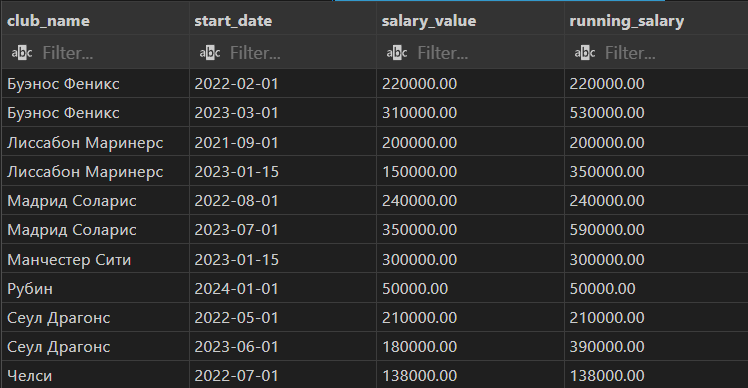
```sql
-- ROWS 1: скользящее среднее зарплаты
SELECT p.first_name,
       c.start_date,
       CAST(c.salary AS NUMERIC) AS salary_value,
       AVG(CAST(c.salary AS NUMERIC)) OVER (
           ORDER BY c.start_date
           ROWS BETWEEN 1 PRECEDING AND 1 FOLLOWING
       ) AS salary_moving_avg
FROM football_club.players p
JOIN football_club.contracts c ON c.player_id = p.player_id
ORDER BY c.start_date;
```
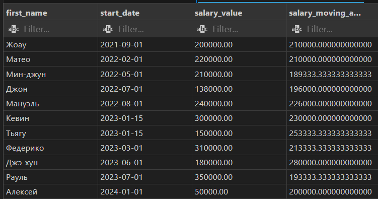
```sql
-- ROWS 2: накопление очков по клубу
SELECT fc.name AS club_name,
       p.season,
       25 - p.final_position AS season_score,
       SUM(25 - p.final_position) OVER (
           PARTITION BY fc.name
           ORDER BY split_part(p.season, '/', 1)::INT
           ROWS BETWEEN UNBOUNDED PRECEDING AND CURRENT ROW
       ) AS running_score
FROM football_club.participation p
JOIN football_club.football_clubs fc ON fc.club_id = p.club_id
ORDER BY club_name, season;
```
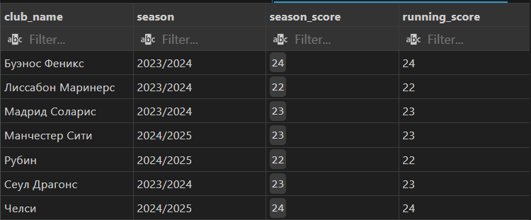
```sql
-- RANGE 1: средняя стоимость игроков в окне 5 млн
SELECT p.first_name,
       CAST(p.market_value AS NUMERIC) AS market_value,
       AVG(CAST(p.market_value AS NUMERIC)) OVER (
           ORDER BY CAST(p.market_value AS NUMERIC)
           RANGE BETWEEN 5000000 PRECEDING AND CURRENT ROW
       ) AS range_avg_value
FROM football_club.players p
ORDER BY market_value;
```
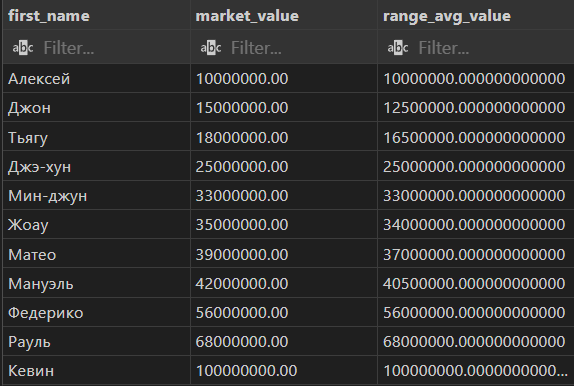
```sql
-- RANGE 2: зарплата в окне 1 года
SELECT p.first_name,
       c.start_date,
       CAST(c.salary AS NUMERIC) AS salary_value,
       SUM(CAST(c.salary AS NUMERIC)) OVER (
           ORDER BY c.start_date
           RANGE BETWEEN INTERVAL '365 days' PRECEDING AND CURRENT ROW
       ) AS salary_year_window
FROM football_club.players p
JOIN football_club.contracts c ON c.player_id = p.player_id
ORDER BY c.start_date;
```
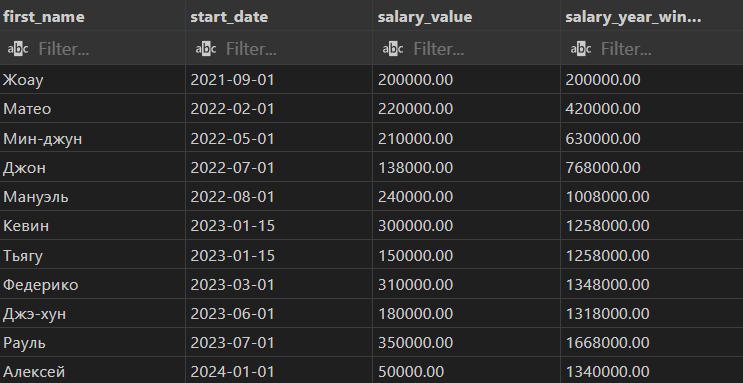
```sql
-- ROW_NUMBER: порядок игроков внутри клуба
SELECT fc.name AS club_name,
       p.first_name,
       CAST(p.market_value AS NUMERIC) AS market_value,
       ROW_NUMBER() OVER (
           PARTITION BY fc.name
           ORDER BY CAST(p.market_value AS NUMERIC) DESC
       ) AS rn_in_club
FROM football_club.players p
JOIN football_club.football_clubs fc ON fc.club_id = p.club_id
ORDER BY club_name, rn_in_club;
```
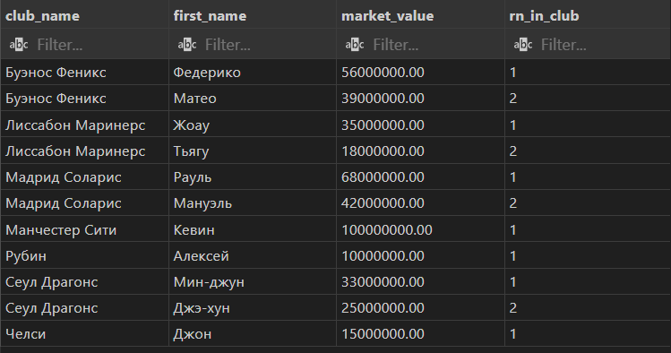
```sql
-- RANK: общий рейтинг по зарплате
SELECT p.first_name,
       CAST(c.salary AS NUMERIC) AS salary_value,
       RANK() OVER (ORDER BY CAST(c.salary AS NUMERIC) DESC) AS salary_rank
FROM football_club.players p
JOIN football_club.contracts c ON c.player_id = p.player_id
ORDER BY salary_rank, p.first_name;
```
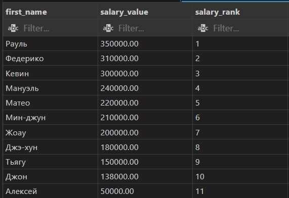
```sql
-- DENSE_RANK: места клубов по сезону
SELECT p.season,
       fc.name AS club_name,
       p.final_position,
       DENSE_RANK() OVER (
           PARTITION BY p.season
           ORDER BY p.final_position
       ) AS finish_rank
FROM football_club.participation p
JOIN football_club.football_clubs fc ON fc.club_id = p.club_id
ORDER BY p.season, finish_rank;
```
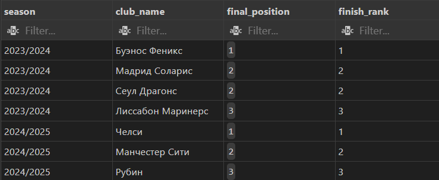
```sql
-- NTILE: квартиль по стоимости игроков
SELECT p.first_name,
       CAST(p.market_value AS NUMERIC) AS market_value,
       NTILE(4) OVER (ORDER BY CAST(p.market_value AS NUMERIC) DESC) AS value_quartile
FROM football_club.players p
ORDER BY value_quartile, market_value DESC;
```
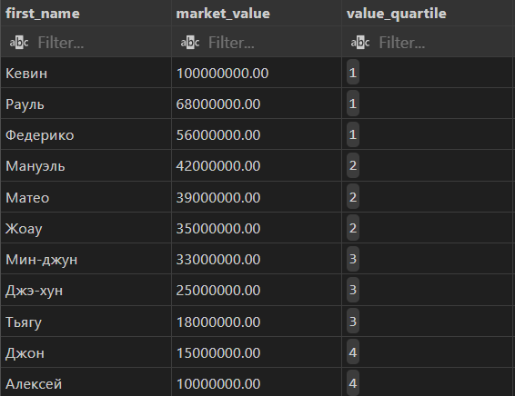
```sql
-- LAG: предыдущая зарплата внутри клуба
SELECT fc.name AS club_name,
       p.first_name,
       CAST(c.salary AS NUMERIC) AS salary_value,
       LAG(CAST(c.salary AS NUMERIC)) OVER (
           PARTITION BY fc.name
           ORDER BY c.start_date
       ) AS previous_salary
FROM football_club.contracts c
JOIN football_club.players p ON p.player_id = c.player_id
JOIN football_club.football_clubs fc ON fc.club_id = p.club_id
ORDER BY club_name, c.start_date;
```
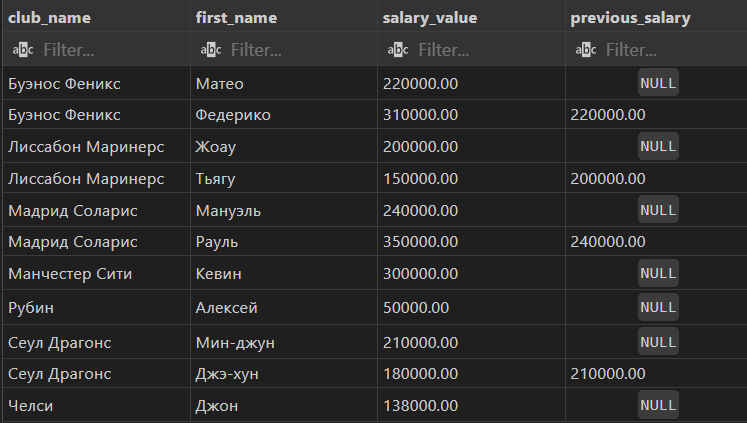
```sql
-- LEAD: следующая позиция клуба
SELECT fc.name AS club_name,
       p.season,
       p.final_position,
       LEAD(p.final_position) OVER (
           PARTITION BY fc.name
           ORDER BY split_part(p.season, '/', 1)::INT
       ) AS next_position
FROM football_club.participation p
JOIN football_club.football_clubs fc ON fc.club_id = p.club_id
ORDER BY club_name, season;
```
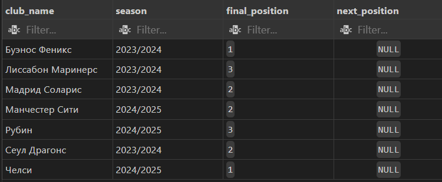
```sql
-- FIRST_VALUE: лучшая позиция клуба
SELECT fc.name AS club_name,
       FIRST_VALUE(p.final_position) OVER (
           PARTITION BY fc.name
           ORDER BY p.final_position
           ROWS BETWEEN UNBOUNDED PRECEDING AND UNBOUNDED FOLLOWING
       ) AS best_position
FROM football_club.participation p
JOIN football_club.football_clubs fc ON fc.club_id = p.club_id
ORDER BY club_name;
```
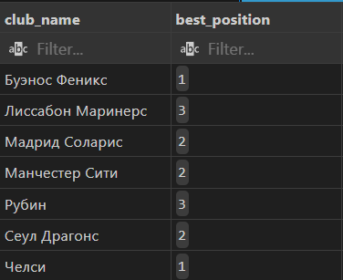
```sql
-- LAST_VALUE: худшая позиция клуба
SELECT fc.name AS club_name,
       LAST_VALUE(p.final_position) OVER (
           PARTITION BY fc.name
           ORDER BY p.final_position
           ROWS BETWEEN UNBOUNDED PRECEDING AND UNBOUNDED FOLLOWING
       ) AS worst_position
FROM football_club.participation p
JOIN football_club.football_clubs fc ON fc.club_id = p.club_id
ORDER BY club_name;
```
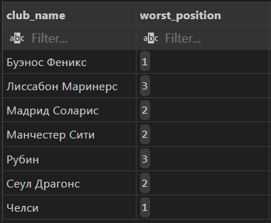


