## 1 задание 
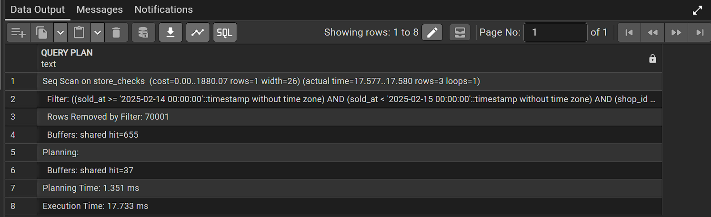
Тип сканирования Seq Scan 

Индексы idx_store_checks_payment_type и idx_store_checks_total_sum_hash не используются

Планировщик выбирает Seq Scan, потому что нет индекса по (shop_id, sold_at) или по shop_id в отдельности,

много строк подзодит под условие

CREATE INDEX idx_store_checks_shop_id_sold_at
ON store_checks (shop_id, sold_at);

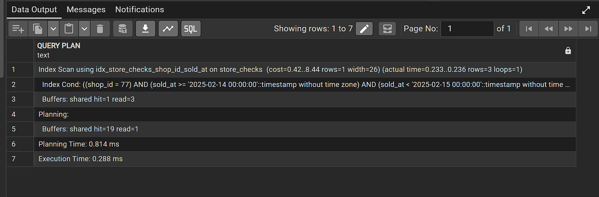

Появился Index Scan

Планировщик теперь идёт по индексу по shop_id = 77, затем фильтрует по диапазону sold_at, и затем достаёт нужные колонки.

Скорость растёт, потому что

индекс быстро находит нужные строки,

не нужно читать все 70000 строк таблицы.
ANALYZE store_checks;
ANALYZE нужно выполнить, чтобы таблица и статистика по ней обновились, тогда оптимизатор точнее оценит стоимость планов и выберет оптимальный индекс.

## 2 задание 
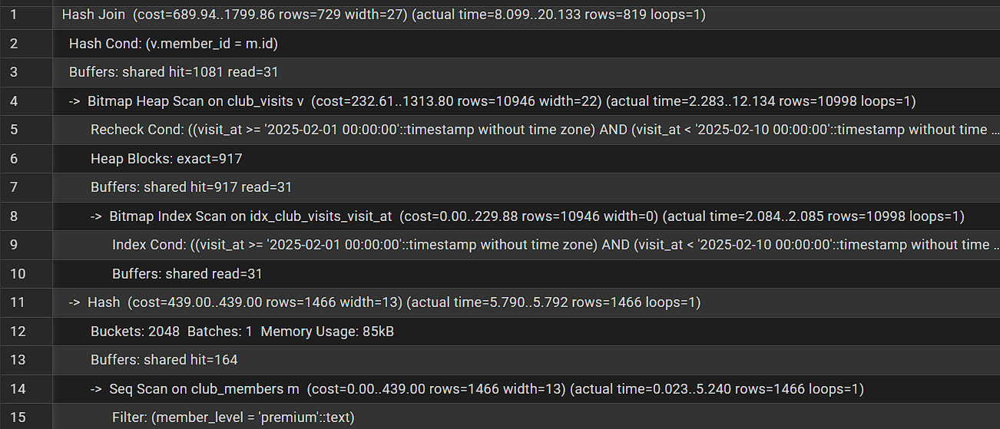
тут hash join ПОТОМУ ЧТО = ИСПОЛЬЗУЕТСЯ
Индекс idx_club_visits_visit_at частично помогает, если используется для фильтрации по visit_at, но без индекса по member_id ключ JOIN работает медленно.

Индекс idx_club_members_full_name не полезен, потому что в запросе используется member_level, а не full_name.

CREATE INDEX idx_club_visits_member_id_visit_at
ON club_visits (member_id, visit_at);

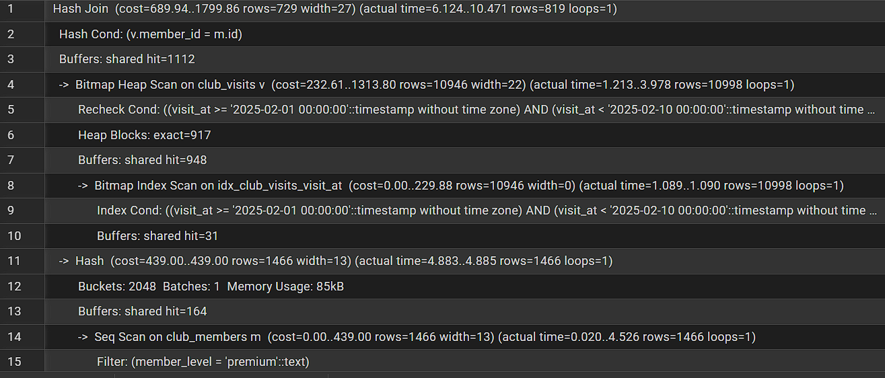

появился index scan вместо полного сканирования
join стал быстрее
shared hit страница уже была в буферном кэше, поэтому чтение лучше по сравнению с диском.

shared read  страница физически прочитана с диска.

Если shared hit сильно преобладает, это означает, что данные в основном лежат в кэше и операция эффективна если много shared read, запрос нагружает диск.

## 3 задание
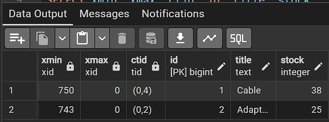

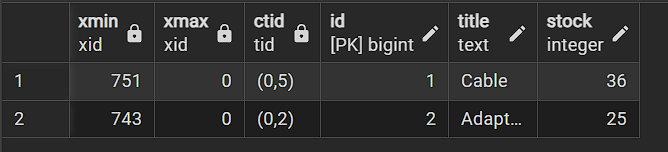

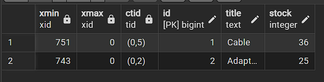

после update старая строка помечается xmax
создается новая строка с xmin и новым ctid
stock изменился
в mvcc update вставляется новую версию и помечает старую

после delete
строка поулчает xmax и больше не видна для select 
но она остается пока vacuum не удалит
vacuum пересканирует таблицу и помечает старые версии строк и освобождает место не блокируя таблицу
autovacuum фоновый и автоматически собирает ненужные строки и обновляет статистику
vACUUMFULL перестраивает таблицу целиком и удаляет ненужные строки и сжимает файл бд и полностью бокирует таблицу

## Задание 4
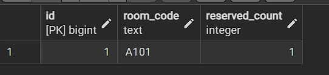

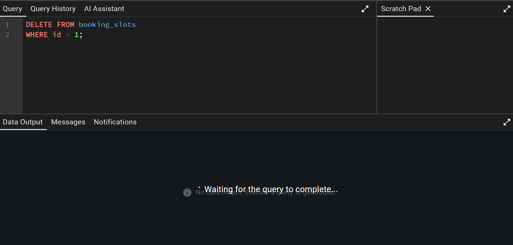

delete ожидает снятие блокировки for key

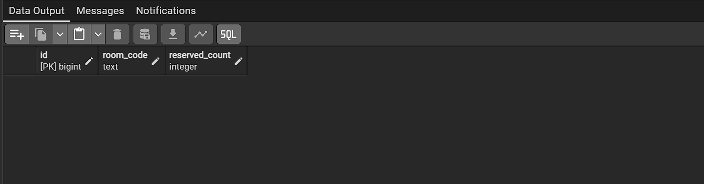

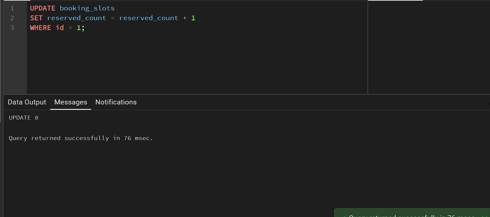
for key sharee слабее блокируется
разрешает update но запрещает delete
for no key share запрещает любые update delete но позволяет другим сессиям читать строку без блокировки
обычный селект без forkeyshare for no key share не блоокирует поэтому delete update в сессии б сразу выполняется